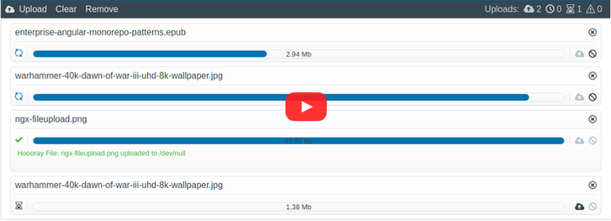

# ngx file upload

Angular 8 Mono Repo for asynchronous file uploads.

Formerly @ r-hannuschka / ngx-fileupload library which has now been divided into 2 areas.

- ngx-file-upload / core which only contain services / classes to enable file upload with Angular
- ngx-file-upload / ui which contains the components / pipes to provide a UI.

This ensures that if a completely own UI is to be built (without ngx-file-upload / ui) the overhead of SCSS, fonts, images and components no longer exists.

| | |   |
|---|---|---|
|  | core files for async file uploads with angular |  |
|  | ui components for ngx-file-upload |  |
|  | full package contains (ui and core) (no longer maintained) |  |

## Demo

Watch [Demo](https://r-hannuschka.github.io/ngx-fileupload/#/) to see ngx fileupload in action, customizing views and add validations.

## Credits

<!--
All icon fonts was created with [IconMoon App](https://icomoon.io/app/#/select)
-->

Special thanks for code reviews, great improvements and ideas to

||||  
|:-:|:-:|:-:|
| Konrad Mattheis|  Thomas Haenig|    Alexander Görlich|

## Author

Ralf Hannuschka [Github](https://github.com/r-hannuschka)

## Other Modules

- [ngx-responsivemenu](https://github.com/r-hannuschka/ngx-responsivemenu)
